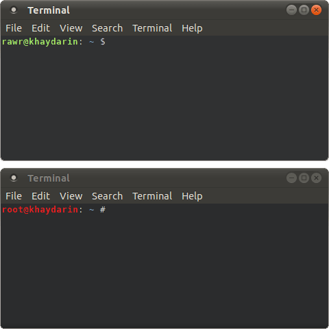
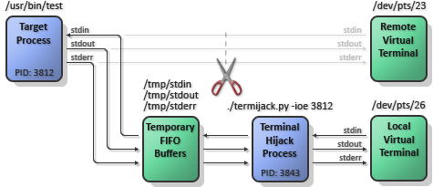
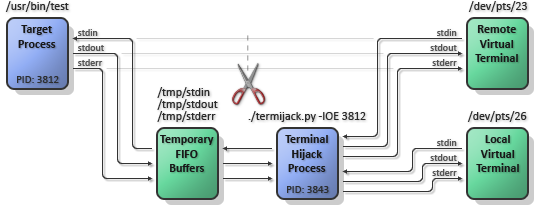

# Terminal Hijacker #

## Introduction ##



TermiJack hijacks the standard streams (stdout, stdin, and/or stderr) from an already
running process and silently returns them back after finishing. While this
script is running and attached to another process, the user may interact with
the running process as if they were interacting with the original terminal.

This script also provides the ability to mirror hijacked streams. In the case
of standard input, this means that inputs from both this terminal and the
remote terminal will be forwarded to the target process. Similarly, standard
output and error coming from the target process will be forwarded to both this
terminal and the remote terminal.

While gdb is being used to hijack standard streams, there may be a small
latency during the transition where the target process is paused. Do _not_ use
this script on time-critical processes. Also, this script may need to be run as
root in order for gdb to do its business.

Lastly, this script performs poorly with programs using either the ncurses or
readline GNU libraries due to the special way they interact with input/output
streams. Support for them may be added in the future.

Requires the GNU Debugger (gdb) in order to run.


## Theory ##

Typically, the standard streams (stdin, stdout, stderr) are connected to a
virtual terminal like ```/dev/pts/23``` as show below:


Using gdb to intercept the target process, we can use syscalls (open, fcntl)
to create a set of named pipes that will act as the intermediate socket between
the target process and the hijacker script. Other syscalls (dup, dup2) are used
to clone the original standard streams to temporary place-holders and to swap
the file descriptors of the named pipes and standard streams.

In the situation where we only hijack the standard streams and don't reflect
the to/from the original streams, this setup looks something like the following:



The termijack script also allows the ability to mirror the standard streams
to/from the hijacked process. This means that the hijacked stdin and hijacker's
stdin will be multiplexed to the target process. Additionally, and stdout or
stderr coming from the hijacked process will be sent to both the hijacked
virtual terminal and to the hijacker's virtual terminal. This setup looks
something like the following:



Of course, at the very end, when the termijack script detaches from the target
process, it will undo all of the shenanigans and close file descriptors that it
opened. Ideally, it's operation should be very surreptitious.


## Usage ##

Hijack stdin, stdout, and stderr:

* ```./termijack.py -ioe $TARGET_PID```

Hijack stdin, stdout, and stderr. Also, reflect them back to the target process:

* ```./termijack.py -IOE $TARGET_PID```
